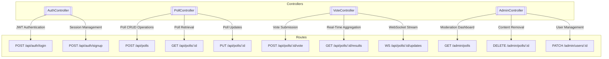

# Hush Poll - Anonymous Polling System

Hush Poll is a secure, anonymous polling application built with modern web technologies. It allows users to create and participate in polls while maintaining privacy and data security.

## Table of Contents

- [Features](#features)
- [Architecture](#architecture)
- [Tech Stack](#tech-stack)
- [Getting Started](#getting-started)
  - [Prerequisites](#prerequisites)
  - [Installation](#installation)
  - [Configuration](#configuration)
- [Running the Application](#running-the-application)
- [API Endpoints](#api-endpoints)
- [Authentication](#authentication)
- [Socket.IO Events](#socketio-events)
- [Database](#database)
- [Demo Credentials](#demo-credentials)
- [Development](#development)
- [License](#license)

## Features

- **Anonymous Polls**: Create and participate in polls without revealing personal information
- **Multiple Poll Types**: Support for single-choice and multiple-choice polls
- **Real-time Updates**: Live poll results using WebSocket connections
- **Private Polls**: Secure polls with invite codes
- **Expiration Dates**: Set time limits for poll availability
- **Admin Dashboard**: Moderation tools for poll management
- **Responsive Design**: Works on desktop and mobile devices
- **Dark Mode Support**: User-friendly interface in any lighting condition

## Architecture

The application follows a client-server architecture with the following components:



## Tech Stack

### Frontend
- **Framework**: Next.js
- **UI Library**: React
- **Styling**: Tailwind CSS with Shadcn UI components
- **State Management**: React Context API
- **Form Handling**: React Hook Form with Zod validation
- **Data Visualization**: Recharts

### Backend
- **Runtime**: Node.js
- **Framework**: Express.js
- **Database**: MongoDB with Mongoose
- **Authentication**: JWT (JSON Web Tokens)
- **Real-time Communication**: Socket.IO
- **Validation**: Zod
- **Logging**: Winston

## Getting Started

### Prerequisites

- Node.js (v16 or higher)
- MongoDB (v4.4 or higher)
- npm or pnpm

### Installation

1. Clone the repository:
   ```bash
   git clone https://github.com/yourusername/hush-poll.git
   cd hush-poll
   ```

2. Install backend dependencies:
   ```bash
   cd backend
   npm install
   ```

3. Install frontend dependencies:
   ```bash
   cd ../frontend
   npm install
   ```

### Configuration

1. Create a `.env` file in the backend directory with the following variables:
   ```
   PORT=5000
   MONGODB_URI=mongodb://localhost:27017/polling-app
   JWT_SECRET=your_jwt_secret_key
   ENCRYPTION_KEY=your_encryption_key
   FRONTEND_URL=http://localhost:3000
   ```

2. Create a `.env.local` file in the frontend directory:
   ```
   NEXT_PUBLIC_API_URL=http://localhost:5000/api
   ```

## Running the Application

### Initialize the Database

```bash
cd backend
npm run init-db
```

This will create a default admin user and sample polls.

### Start the Backend Server

```bash
cd backend
npm run dev
```

### Start the Frontend Development Server

```bash
cd frontend
npm run dev
```

The application will be available at http://localhost:3000.

## API Endpoints

### Authentication
- `POST /api/auth/register` - Register a new user
- `POST /api/auth/login` - Login existing user

### Polls
- `POST /api/polls` - Create a new poll
- `GET /api/polls` - Get all public polls
- `GET /api/polls/:id` - Get a specific poll
- `PUT /api/polls/:id` - Update a poll
- `POST /api/polls/:id/vote` - Vote on a poll
- `GET /api/polls/:id/results` - Get poll results

### Admin
- `GET /api/admin/polls` - Get all polls (admin only)
- `DELETE /api/admin/polls/:id` - Delete a poll (admin only)
- `PATCH /api/admin/users/:id/suspend` - Suspend a user (admin only)

## Authentication

The application uses JWT (JSON Web Tokens) for authentication. After logging in, the token should be included in the Authorization header for protected API requests:

```
Authorization: Bearer <token>
```

## Socket.IO Events

- `joinPoll` - Join a poll room for real-time updates
- `leavePoll` - Leave a poll room
- `voteUpdate` - Receive real-time vote updates

## Database

The application uses MongoDB with the following main collections:

- **Users**: Stores user accounts and authentication information
- **Polls**: Stores poll questions, options, and settings
- **Votes**: Stores encrypted user votes

## Demo Credentials

- **Admin User**:
  - Email: admin@example.com
  - Password: admin123

## Development

### Linting

```bash
# Frontend
cd frontend
npm run lint

# Backend
cd backend
npm run lint
```

### Building for Production

```bash
# Backend
cd backend
npm run build

# Frontend
cd frontend
npm run build
```

## License

This project is licensed under the MIT License - see the LICENSE file for details.