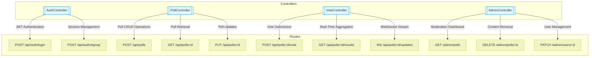

```mermaid
flowchart TB
    subgraph Controllers
        A[[AuthController]]
        B[[PollController]]
        C[[VoteController]]
        D[[AdminController]]
    end

    subgraph Routes
        R1[POST /api/auth/login]
        R2[POST /api/auth/signup]
        R3[POST /api/polls]
        R4[GET /api/polls/:id]
        R5[PUT /api/polls/:id]
        R6[POST /api/polls/:id/vote]
        R7[GET /api/polls/:id/results]
        R8[WS /api/polls/:id/updates]
        R9[GET /admin/polls]
        R10[DELETE /admin/polls/:id]
        R11[PATCH /admin/users/:id]
    end

    A -->|JWT Authentication| R1
    A -->|Session Management| R2
    B -->|Poll CRUD Operations| R3
    B -->|Poll Retrieval| R4
    B -->|Poll Updates| R5
    C -->|Vote Submission| R6
    C -->|Real-Time Aggregation| R7
    C -->|WebSocket Stream| R8
    D -->|Moderation Dashboard| R9
    D -->|Content Removal| R10
    D -->|User Management| R11

    classDef controller fill:#e1f5fe,stroke:#039be5;
    classDef route fill:#f0f4c3,stroke:#c0ca33;
    class A,B,C,D controller;
    class R1,R2,R3,R4,R5,R6,R7,R8,R9,R10,R11 route;
    
    A:::controller 
    B:::controller 
    C:::controller 
    D:::controller 
    R1:::route 
    R2:::route 
    R3:::route 
    R4:::route 
    R5:::route 
    R6:::route 
    R7:::route 
    R8:::route 
    R9:::route 
    R10:::route 
    R11:::route 
    
    click A "https://example.com/authFeatures" "Key Features:\n- JWT Token Generation\n- Session Validation\n- Password Hashing"
    click B "https://example.com/pollFeatures" "Key Features:\n- Poll Schema Validation\n- Expiration Scheduling\n- Invite Code Generation"
    click C "https://example.com/voteFeatures" "Key Features:\n- Anonymous Vote Tracking\n- Duplicate Prevention\n- GDPR Compliance"
    click D "https://example.com/adminFeatures" "Key Features:\n- Content Moderation\n- User Suspension\n- Audit Logging"
```